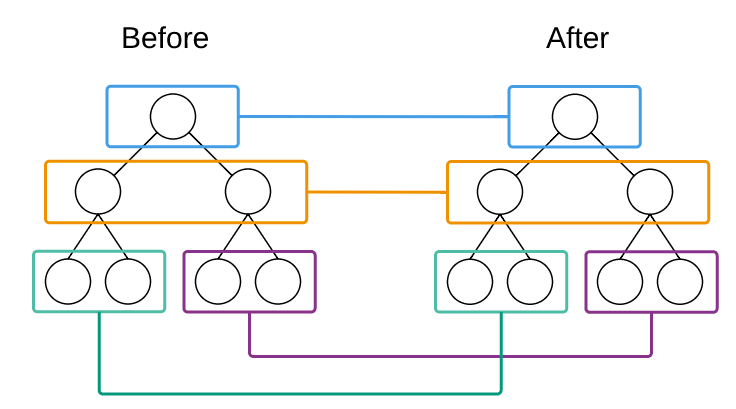
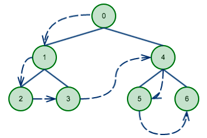
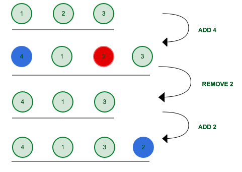

title: VirtualDOM实现的简单实践
date: 2016-03-25
tags: react, javascript
categories: javascript
---

# 前言
`React`最近在前端圈几乎无人不知，和人聊天不聊几句`React`都不好意思说自己是学前端的，`VirtualDOM`功不可没。正好最近在找前端方面的实习，于是便研究了下VirtualDOM的算法，实现了一个非常简陋的版本以帮助自己理解。

<!--more-->

# 什么是 VirtualDOM

## 面临的问题
受制于标准的原因，`DOM` 是非常复杂的，所以我们要尽可能减少对DOM的操作。传统的思路是当状态发生改变时就重新渲染 `DOM`，后来发现很多情况下状态的改变并不会引起页面完全改变，一般只需要做部分修改就可以。

## MVVM的思路
一些`MVVM`框架（例如`Vue`）提出的解决方案是绑定状态（model）和DOM中对应的部分，在某个状态发生改变时去改变其对应的节点，而`AngularJS`则采用脏检查的方式来寻找需要重新渲染的`DOM`节点。

## VirtualDOM
`VirtualDOM`的思路则更加直接，在状态发生改变时，将其变化反映到一个JavaScript对象（即`VirtualDOM`）上，然后将这个对象和老对象进行比较得出差异，并将差异应用到真实`DOM`上，来将`DOM`操作控制在最小。

# 算法实现

## 概括
整个`VirtualDOM` 算法的核心主要包括三个部分

- 模拟真实`DOM`
- 比较两个`VirtualDOM`树的差异
- 把差异应用到真实`DOM`上

## 模拟真实`DOM`

这点很容易做到，我们只保留一些简单的信息，

```js
var vdom = function(){
  function VElement(tagname, prop, children, option){
    this.tagname = tagname
    this.prop = prop
    this.children = children
    this.key = option && option.key
  }
  function el(tagname, prop, children, option){
    return new VElement(tagname, prop, children, option)
  }
  return {
    VElement: VElement,
    el:el
  }
}
```

这样用
```js
var ul = vdom.el('ul', {id: 'list'},[
  vdom.el('h1', {style: 'color:red'}, ['Title']),
  vdom.el('li', {class: 'item'}, ['Item 1'], {key: 1}),
  vdom.el('li', {class: 'item'}, ['Item 2'], {key: 2}),
  vdom.el('li', {class: 'item'}, ['Item 3'], {key: 3})
])
```

就可以描述一个DOM对象（其中`key`的作用将在后面介绍）

写一个`render`函数来将其渲染为真实`DOM`，其中将字符串直接视为文本节点：
```js
VElement.prototype.render = function(){
    var el = document.createElement(this.tagname)
    for(var propKey in this.prop){
      el.setAttribute(propKey, this.prop[propKey])
    }
    var children = this.children || []
    children.forEach(function(child){
      if(child instanceof VElement){
        el.appendChild(child.render())
      }else if(typeof child === "string"){
        el.appendChild(document.createTextNode(child))
      }
    })
    return el
  }
```

## 比较两个`VirtualDOM`树的差异
如何比较两个树的差异是最核心的部分（这也影响着如何将其应用到真实`DOM`上），不同于完整的比较，`React` 为了降低这个算法的复杂度（也更适应前端开发的事实）做出了两个基本的假设

- 两个相同组件产生类似的`DOM`结构，不同的组件产生不同的`DOM`结构
- 对于同一层次的一组子节点，它们可以通过唯一的`key`进行区分

### 记录差异
在`diff`算法中我们要记录下得到的差异，最后得到一个`patch`列表，其`index`是用来识别`patch`应用的位置的。

```js
 VElement.prototype.diff = function(newEl){
    var patches = []
    walkEl(this, newEl, 0, patches)
    return patches
  }

 function walkEl(oldEl, newEl, index, patches){
    var currentPatch = [];
    // 节点比较
    // （子节点）列表比较
    patches[index] = currentPatch
  }
```

### 逐层比较
基于第一个假设（`DOM`结构总是稳定的，不稳定的视为另外一个不同的组件），`React` 选择只对同一个层的元素进行比较，这样可以将算法的复杂度从`O(n^3)`降低到`O(n)`。



#### 遍历顺序
在设计`diff`算法时我们也必须考虑`patch`时的遍历顺序，在`patch`时我们采用深度优先的方法，先完成子节点差异的`patch`，后完成父节点的。



### 列表比较
思考一个问题，当我们有一个
```html
<div>
  <item1></item1>
  <item2></item2>
  <item3></item3>
</div>
```

变成
```html
<div>
  <item4></item4>
  <item1></item1>
  <item3></item3>
  <item2></item2>

</div>
```

时，最小的改动为是插入`<item4>`，删除`<item2>`然后插入`<item2>`到末尾。




这是一个典型的最小编辑距离问题，为了让框架正确的进行重排，我们需要给每个项指定一个`key`作为唯一的身份，这就是上文提到的`key`的作用。（类似的，`Vue`中也提供了`track-by="$index"`来提高列表差异比较的性能）。

关于最小编辑距离，可以先刷一遍`Leetcode`上[一道相关的题目](https://leetcode.com/problems/edit-distance/)理解下，这里也有篇思路非常清晰的文章介绍最小编辑距离算法：https://segmentfault.com/a/1190000003741294 。唯一的区别是我们要保留整个操作的过程，可以参考 [listdiff](https://github.com/CodeFalling/vdom/blob/gh-pages/vdom.js#L96)。

当然这里其实还有更多的优化可以做，例如合并多个`ADD`等等，但是我没有去实现。
### 节点比较
同样基于第一个假设，当节点类型完全改变时（例如从`<div>`变成`<span>`），我们认为是完全另外一个节点，直接销毁原来的节点并替换（这也符合我们对前端操作的直觉）。而当节点类型不变时，只要记录其改变并应用即可。

```js
 VElement.prototype.diff = function(newEl){
    var patches = []
    walkEl(this, newEl, 0, patches)
    return patches
  }

 function walkEl(oldEl, newEl, index, patches){
    var currentPatch = [];
    // 节点类型的变化 currentPatch.push({type: 'REPLACE', new_val: newEl})
    // 节点属性的变化 currentPatch.push({type: 'PROPS', key: key, new_val: newProps[key]})
    // 节点子节点的变化，使用上面的列表差异算法，得到的 `ADD` `REMOVE` 等操作记录列表为父节点的 `REORDER` patch
    // 仍然需要遍历下去的子节点
    var count = index
    oldEl.children&&oldEl.children.forEach(function(child){
      count += child.count
      var i = childrenDiff.need_walk_old.indexOf(child)
      if(i !== -1){
        // need walk in
        walkEl(childrenDiff.need_walk_old[i], childrenDiff.need_walk_new[i], count, patches)
      }
    })
    patches[index] = currentPatch
  }
```

其中的 `child.count` 上面没有提，其实为了能够获得深度优先遍历的`index`必须在节点中记录其子节点的数量（参见[VElement](https://github.com/CodeFalling/vdom/blob/gh-pages/vdom.js#L3)）


## 把差异应用到真实DOM上
当 `Diff`算法设计出来后，`Patch`算法也就水到渠成了，需要注意的是子节点的重排应该在最后完成，否则重排后的子节点顺序和`patches`中的`index`就不同了。

```js
function applyPatch(dom, patches){
  var walker = {index: 0}
  walkDom(dom, walker, patches)
}

function reorderChildren(dom, diffs){
    diffs.forEach(function(diff){
      switch(diff.type){
        case 'ADD':
          dom.insertBefore(diff.new_val.render(), dom.childNodes[diff.target])
          break
        case 'REMOVE':
          dom.removeChild(dom.childNodes[diff.target])
          break
        case 'REPLACE':
          dom.replaceChild(diff.new_val.render(), dom.childNodes[diff.target])
          break
      }
    })
  }

  function walkDom(dom, walker, patches){
    // save currentPatch
    var currentPatch = patches[walker.index]
    // walk children
    for(var i=0;i<dom.childNodes.length;i++){
      var childnode = dom.childNodes[i];
      walker.index ++
      walkDom(childnode, walker, patches)
    }
    
    if(currentPatch){ // have patche in current node
      currentPatch.forEach(function(patch){
        switch(patch.type){
          case 'REPLACE':
          case 'PROPS':
          case 'TEXT':
			...
          case 'REORDER':
            reorderChildren(dom, patch.diff)
            break
        }
      })
    }

  }
```

# 结语

本文的代码在 https://github.com/CodeFalling/vdom/blob/gh-pages/vdom.js

在线demo：http://codefalling.github.io/vdom/

JSFiddle：https://jsfiddle.net/robturtle/g2vqh30x/

写的仓促，肯定也有些理解不到位或者解释的不清楚的地方，真正的`VirtualDOM`也还有一些更加细致的优化本文没有涉及，欢迎指出交流。

# 参考
- [深度剖析：如何实现一个 Virtual DOM 算法](https://github.com/livoras/blog/issues/13)
- [深入浅出React（四）：虚拟DOM Diff算法解析](http://www.infoq.com/cn/articles/react-dom-diff)
